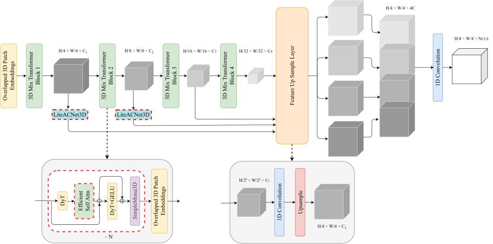
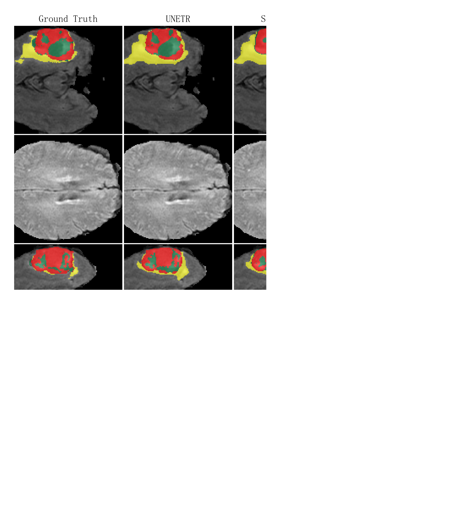
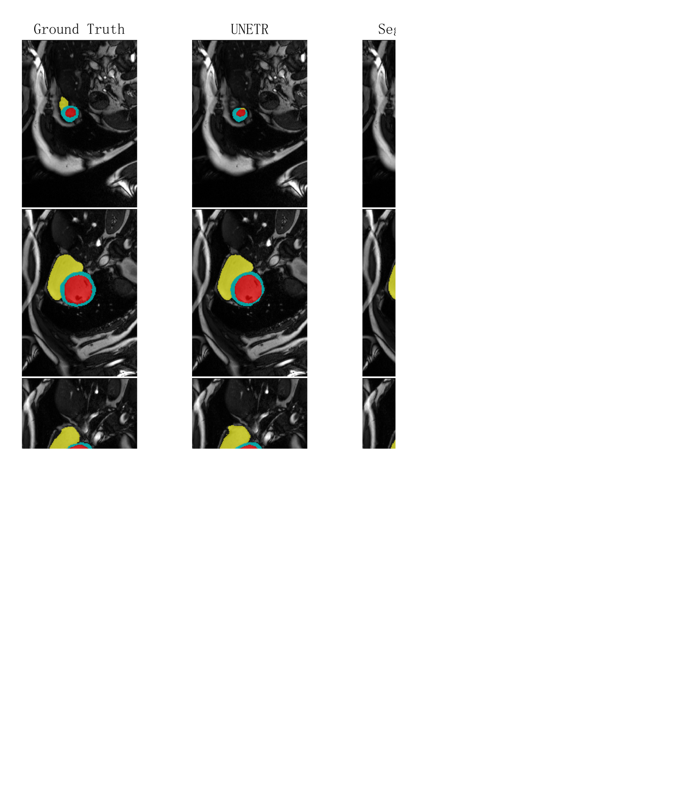

# LiteSegFormer3D：一种高效轻量的三维医学图像分割模型

If you would like to view the English version, click [here](README_EN.md)

## 1. 概述


我们基于SegFormer3D设计了一种轻量高效的医学图像分割网络 **LiteSegFormer3D** ，其在分割精度有所提升的同时，训练时间在三个数据集上缩短了1/3到1/2左右。我们在传统Transformer架构中采用一种新型前馈处理方式加速训练，同时在注意力中使用高斯核函数有效减少可训练参数规模，同时更好的拟合空间纹理特征，同时使用非对称卷积提取浅层特征和动态归一化加速收敛，实现了一种高效且精确的分割算法。

## 2. 安装
```cmd
git clone https://github.com/Strivy-ZSY/litesegformer3d.git
cd litesegformer3d
```
### 2.1 环境要求
1.本代码是在cuda 11.8和python 3.8.20环境中运行的。
```cmd
conda create --name lsf3d python=3.8
conda activate lsf3d
```

2.pytorch 安装（cuda 11.8兼容11.3，故可以正常安装）：
```cmd
pip install torch==1.11.0+cu113 torchvision==0.12.0+cu113 --extra-index-url https://download.pytorch.org/whl/cu113
```

3.其他依赖：
```cmd
pip install -r requirements.txt
```

## 3. 数据集
我们使用的数据分别是[BraTs](https://www.med.upenn.edu/sbia/brats2017/data.html)、[Synapse](https://www.synapse.org/#!Synapse:syn3193805/wiki/217789)和[ACDC](https://www.creatis.insa-lyon.fr/Challenge/acdc/databases.html)
您可以参照[nnFormer](https://github.com/282857341/nnFormer)中数据的预处理方式，或者您也可以从[Google Drive]()直接下载预处理好的数据(我们推荐您这样做，可以节省很多时间🙂)

## 4. 训练

运行`run_scripts`文件夹下的脚本即可，在后续推理中，您只需注释掉脚本中的`train`命令，启用`inference`命令即可。

## 5. 评估

### 5.1 BraTS 2017
BraTS 2017是大脑脑瘤MRI数据集
<p align="center">
  <div style="position: relative; display: inline-block;">
    
    
  </div>
</p>

### 5.2 ACDC
ACDC是心脏器官分割MRI数据集
<p align="center">
  <div style="position: relative; display: inline-block;">
    
    
  </div>
</p>

### 5.3 Synapse
Synapse是腹部多器官分割CT数据集
<p align="center">
  <div style="position: relative; display: inline-block;">
    
    
  </div>
</p>

## 6. 致谢

我们的实现基于[PyTorch](https://github.com/pytorch/pytorch)框架，数据集预处理参考了[nnFormer](https://github.com/282857341/nnFormer)和[UNETR++](https://github.com/Amshaker/unetr_plus_plus)的工作，代码构建参考了[nnUNet](https://github.com/MIC-DKFZ/nnUNet)、[FastKAN](https://github.com/ZiyaoLi/fast-kan)、[ACNet](https://github.com/DingXiaoH/ACNet)和[Mona](https://github.com/LeiyiHU/mona)的工作，基线模型实现参考了[SegFormer3D](https://github.com/OSUPCVLab/SegFormer3D)的工作。
此外，我们编写Readme文件时参考了[TiM4Rec](https://github.com/AlwaysFHao/TiM4Rec)的工作。

## 7. 引用
