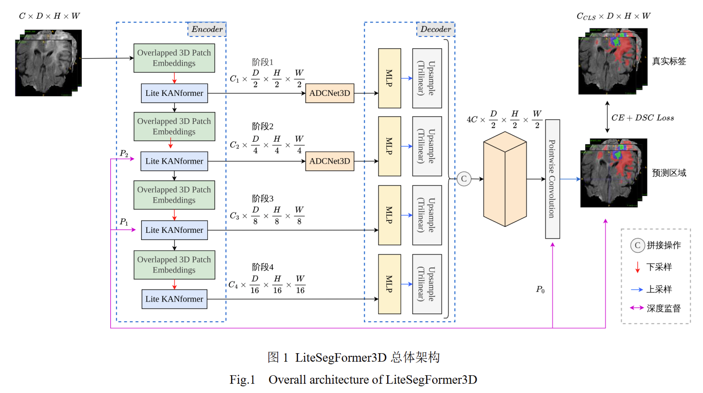
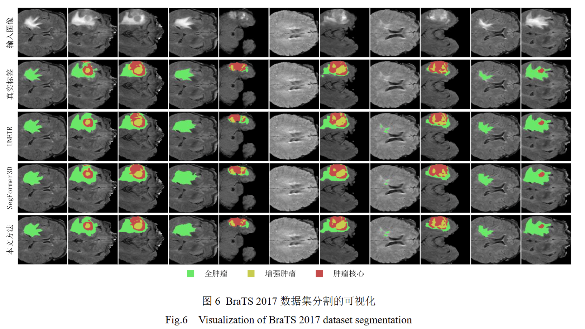
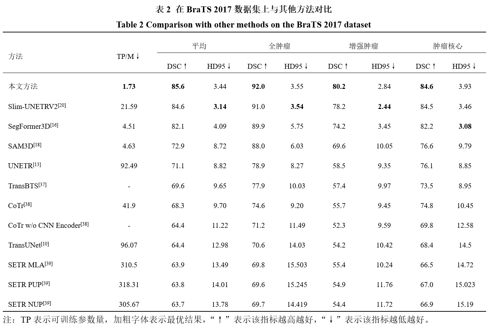
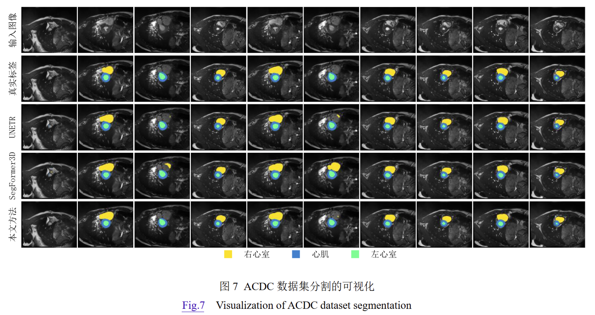
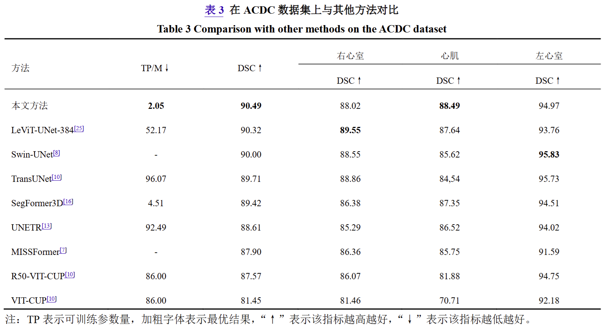
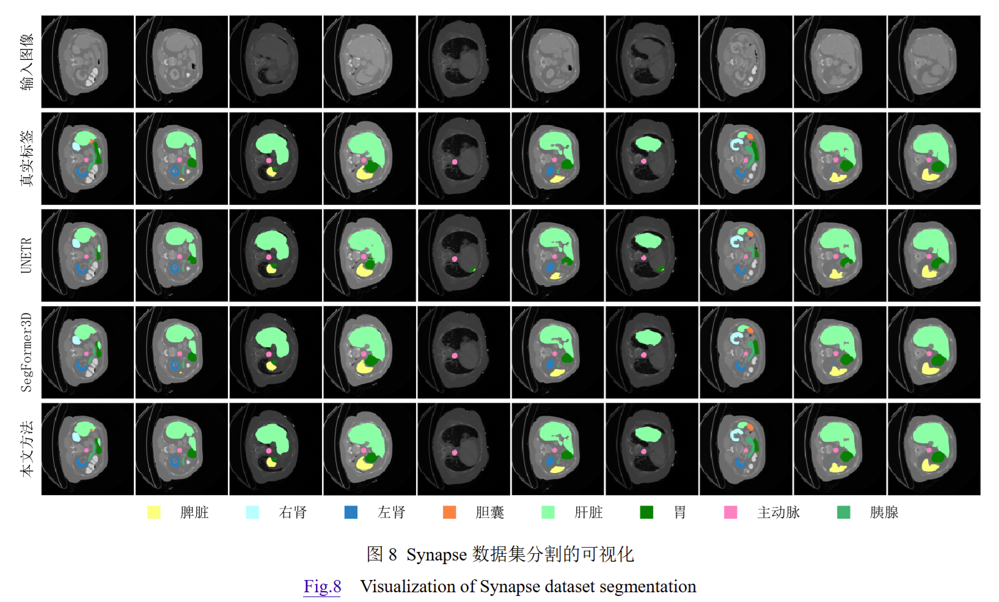
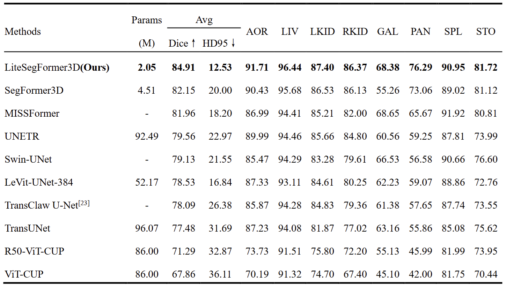

# Lightweight Medical Image Segmentation Incorporating Gaussian Mapping and Adaptive Feedforward

如果您想阅读中文版本，点击[这里](README.md)

## 1. Overview


We designed **LiteSegFormer3D**, a lightweight and efficient medical image segmentation network based on SegFormer3D. It improves segmentation accuracy while reducing training time by one-third to one-half across three datasets. By introducing novel feedforward processing to accelerate training, employing a Gaussian kernel attention mechanism to reduce parameter size while enhancing spatial texture fitting, and combining asymmetric convolutions for shallow feature extraction with dynamic normalization to speed up convergence, we achieve an efficient and accurate segmentation algorithm.

## 2. Installation

```cmd
git clone https://github.com/Strivy-ZSY/litesegformer3d.git
cd litesegformer3d
```
### 2.1 Environmental Requirements
1.This code runs in an environment with CUDA 11.8 and Python 3.8.20.
```cmd
conda create --name lsf3d python=3.8
conda activate lsf3d
```

2.PyTorch installation (CUDA 11.8 is compatible with 11.3, so it can be installed normally):
```cmd
pip install torch==1.11.0+cu113 torchvision==0.12.0+cu113 --extra-index-url https://download.pytorch.org/whl/cu113
```

3.Other dependencies:
```cmd
pip install -r requirements.txt
```

## 3. Dataset

The datasets we use are [BraTS](https://www.med.upenn.edu/sbia/brats2017/data.html), [Synapse](https://www.synapse.org/#!Synapse:syn3193805/wiki/217789), and [ACDC](https://www.creatis.insa-lyon.fr/Challenge/acdc/databases.html). You can refer to the data preprocessing method in [nnFormer](https://github.com/282857341/nnFormer), or you can directly download the preprocessed data from [DATASET](https://sourceforge.net/projects/litesegformer3d/files/)(We recommend doing so to save a lot of time 🙂).

Save your downloaded results in the `litesegformer3d` folder. Using the `BraTS` dataset as an example, the folder structure is organized as follows:

```
./DATASET_Tumor/
  ├── litesegformer3d_raw/
      ├── litesegformer3d_raw_data/
           ├── Task03_tumor/
              ├── imagesTr/
              ├── imagesTs/
              ├── labelsTr/
              ├── labelsTs/
              ├── dataset.json
           ├── Task003_tumor
       ├── litesegformer3d_cropped_data/
           ├── Task003_tumor
```

## 4. Training

Simply run the scripts in the `run_scripts` folder. For subsequent inference tasks, you only need to comment out the `train` command in the script and enable the `inference` command.
The results obtained from training will be stored in the `output_xxx` folder under the `litesegformer3d` directory.

## 5. Evaluation

The `lsf3d/inferencedata` folder contains our evaluation results and the corresponding inference outcomes for the test set. If you wish to perform your own inference to obtain the test results, please modify the test path in `inference_xxx.py` within the `lsf3d` folder to point to your inference test set storage location. 
To evaluate the code execution instructions, you can refer to the [inference.txt](https://github.com/Strivy-ZSY/litesegformer3d/blob/main/lsf3d/inferencedata/inference.txt) file.
Additionally, you can refer to the [nnFormer](https://github.com/282857341/nnFormer/blob/main/nnformer/dataset_json/) partitioning method for the specific division of the **test set**. You will also need to modify the value of `splits[self.fold]['val']` in the corresponding `litesegformer3d_tranier_xxx.py` file within the [training code](https://github.com/Strivy-ZSY/litesegformer3d/tree/main/lsf3d/training/network_training) to the list of test sets.

### 5.1 BraTS 2017
BraTS 2017 is an MRI dataset of brain tumors
<p align="center">
  <div style="position: relative; display: inline-block;">
    
    
  </div>
</p>

### 5.2 ACDC
ACDC is a cardiac organ segmentation MRI dataset(The metrics of `SegFormer3D` here are obtained from our actual measurements.)
<p align="center">
  <div style="position: relative; display: inline-block;">
    
    
  </div>
</p>

### 5.3 Synapse
Synapse is a CT dataset for multi-organ segmentation in the abdomen
<p align="center">
  <div style="position: relative; display: inline-block;">
    
    
  </div>
</p>

## 6. Acknowledgments

Our implementation is based on the [PyTorch](https://github.com/pytorch/pytorch) framework. For dataset preprocessing, we drew inspiration from the work of [nnFormer](https://github.com/282857341/nnFormer) and [UNETR++](https://github.com/Amshaker/unetr_plus_plus). For code construction, we referenced the work of [nnUNet](https://github.com/MIC-DKFZ/nnUNet), [FastKAN](https://github.com/ZiyaoLi/fast-kan), [ACNet](https://github.com/DingXiaoH/ACNet), and [Mona](https://github.com/LeiyiHU/mona). The baseline model implementation was inspired by [SegFormer3D](https://github.com/OSUPCVLab/SegFormer3D). Additionally, we referenced the work of [TiM4Rec](https://github.com/AlwaysFHao/TiM4Rec) when writing the Readme file.

## 7. Citation
Expert review in progress, to be provided subsequently🙂.
